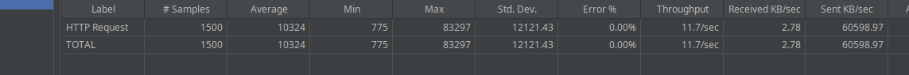
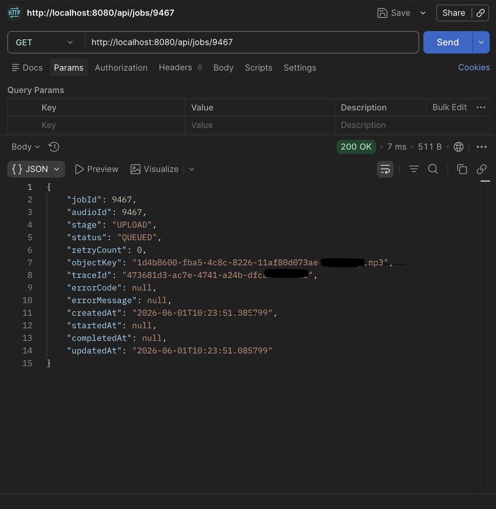
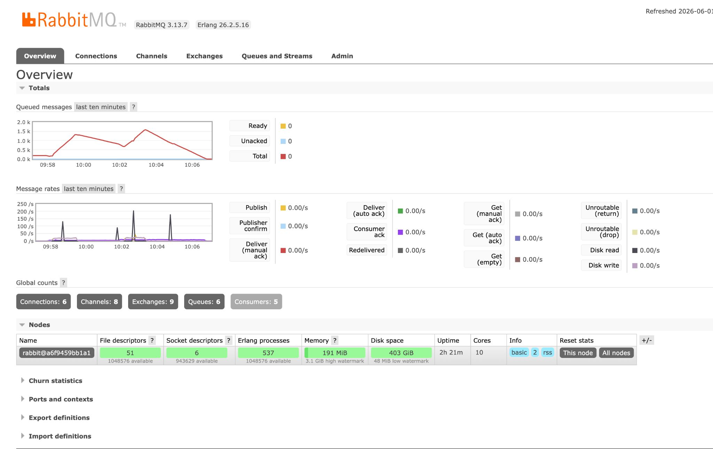
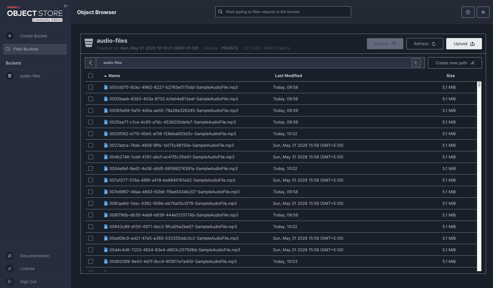

# Async Audio Ingestion Pipeline

An end-to-end audio ingestion system that shows how a synchronous upload flow breaks under load, then how an event-driven design restores throughput and responsiveness.

This project is structured as a two-part case study:

- Part 1: synchronous upload path and load-test results
- Part 2: asynchronous refactor with RabbitMQ-backed background processing

## What This Demonstrates

- How request-thread blocking affects latency under concurrent file uploads
- How event-driven architecture reduces pressure on the API layer
- How to split ingestion, normalization, and transcription into separate stages
- How MinIO, PostgreSQL, RabbitMQ, Spring Boot, and Python workers fit together

## Part 1: Synchronous Baseline

The initial flow was straightforward:

`upload file -> store to MinIO -> save path to DB -> respond`

Every step ran inside the same request thread.

### Load Test

- 150 concurrent users
- 2 second ramp-up
- ~5 MB audio files
- Apache JMeter

### Results

- Average latency: ~10s
- Max latency: 83s
- Throughput: ~11-12 req/sec

### What Was Happening

Spring Boot's default Tomcat thread pool has 200 threads. Each request blocked on two sequential I/O operations:

1. Writing a 5 MB file to MinIO
2. Persisting the file path to PostgreSQL

At 150 concurrent users, most of the thread pool was occupied waiting on I/O. The system did not crash, but requests queued up and latency climbed quickly.



## Part 2: Event-Driven Refactor

The second iteration moves processing off the request path:

`upload -> MinIO -> save metadata/job record -> publish audio.uploaded event -> return 202 Accepted`

Background workers then consume the event and perform:

- Audio normalization
- Audio transcription

### Load Test

- 150 concurrent users
- 2 second ramp-up
- ~5 MB audio files

### Results

| Metric | Synchronous | Event-Driven |
| --- | ---: | ---: |
| Average latency | ~10s | ~7s |
| Max latency | 83s | ~15s |
| Throughput | ~11-12 req/sec | ~20 req/sec |
| Request failures | Not reported | 0% |

### Key Insight

RabbitMQ absorbed bursts by buffering 1500+ jobs, which let the API return quickly while workers processed audio in the background.

### Takeaway

Moving work out of the request thread made the API more responsive and more resilient under heavy upload traffic.






## Stack

- Spring Boot
- RabbitMQ
- Python
- MinIO
- PostgreSQL
- Apache JMeter

## Project Layout

- `AudioPipeline/` - Spring Boot API and supporting domain code
- `workers/` - Python background workers
- `scripts/` - startup and shutdown helpers
- `images/` - benchmark screenshots and pipeline visuals

## Run Locally

### One-shot startup

Start Docker infrastructure, the API, and the workers:

```bash
./scripts/start-everything.sh
```

Stop everything:

```bash
./scripts/stop-everything.sh
```

### Manual startup

Start the infrastructure and prepare the Python environment:

```bash
./scripts/start-pipeline.sh
```

Start the Spring Boot API:

```bash
cd AudioPipeline && ./mvnw spring-boot:run
```

Start the Python workers:

```bash
./scripts/run-python-workers.sh
```

### Test the upload API

```bash
curl -X POST http://localhost:8080/api/upload -F "file=@your_audio.mp3"
```

## Worker Notes

The worker setup and dependencies are documented in [`workers/README.md`](workers/README.md).

## Screenshots

- Synchronous baseline: [`images/Synchronous_test_SummaryReport.png`](images/Synchronous_test_SummaryReport.png)
- Event-driven iteration: [`images/2nd-iteration/Summary_Report.jpeg`](images/2nd-iteration/Summary_Report.jpeg)
